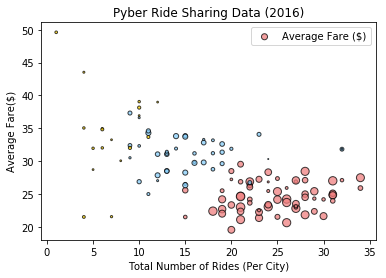
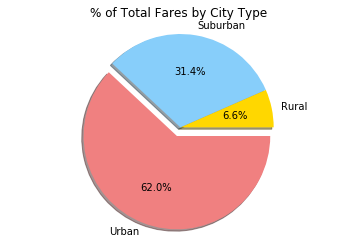
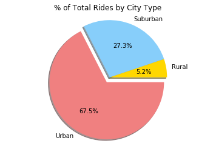
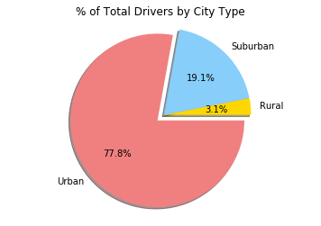

```python
# Observations
# 1 Rural city type has the lowerst % of rides, number of drivers, total fare, and the highest avearge fare.
# 2 Surburban city type average fare is generally higher than the urban type.
# 3 Urban city type has the highest % of rides, number of drivers, total fare, and the lowest average fare.
```


```python
import matplotlib.pyplot as plt
import pandas as pd
import numpy as np
import os
```


```python
ride_data = os.path.join('raw_data', 'ride_data.csv')
city_data = os.path.join('raw_data', 'city_data.csv')

ride_data_df = pd.read_csv(ride_data)
city_data_df = pd.read_csv(city_data)

rides_df = ride_data_df.groupby("city")["fare"].agg({"Average Fare ($)": "mean", "Total Fare ($)": "sum","Rides" : "count"}).reset_index()
pyber_df = pd.merge(city_data_df, rides_df,
                    on='city')
pyber_df.head()

```

    C:\Users\JenChen\Anaconda3\lib\site-packages\ipykernel_launcher.py:7: FutureWarning: using a dict on a Series for aggregation
    is deprecated and will be removed in a future version
      import sys
    


<div>
<style>
    .dataframe thead tr:only-child th {
        text-align: right;
    }

    .dataframe thead th {
        text-align: left;
    }

    .dataframe tbody tr th {
        vertical-align: top;
    }
</style>
<table border="1" class="dataframe">
  <thead>
    <tr style="text-align: right;">
      <th></th>
      <th>city</th>
      <th>driver_count</th>
      <th>type</th>
      <th>Average Fare ($)</th>
      <th>Total Fare ($)</th>
      <th>Rides</th>
    </tr>
  </thead>
  <tbody>
    <tr>
      <th>0</th>
      <td>Kelseyland</td>
      <td>63</td>
      <td>Urban</td>
      <td>21.806429</td>
      <td>610.58</td>
      <td>28</td>
    </tr>
    <tr>
      <th>1</th>
      <td>Nguyenbury</td>
      <td>8</td>
      <td>Urban</td>
      <td>25.899615</td>
      <td>673.39</td>
      <td>26</td>
    </tr>
    <tr>
      <th>2</th>
      <td>East Douglas</td>
      <td>12</td>
      <td>Urban</td>
      <td>26.169091</td>
      <td>575.72</td>
      <td>22</td>
    </tr>
    <tr>
      <th>3</th>
      <td>West Dawnfurt</td>
      <td>34</td>
      <td>Urban</td>
      <td>22.330345</td>
      <td>647.58</td>
      <td>29</td>
    </tr>
    <tr>
      <th>4</th>
      <td>Rodriguezburgh</td>
      <td>52</td>
      <td>Urban</td>
      <td>21.332609</td>
      <td>490.65</td>
      <td>23</td>
    </tr>
  </tbody>
</table>
</div>


```python
# bubble chart
colors = {"Urban": "lightcoral", "Suburban": "lightskyblue", "Rural":"gold"}
plt.scatter(pyber_df["Rides"], pyber_df["Average Fare ($)"], s = pyber_df["driver_count"], c=[colors[i] for i in pyber_df["type"]], alpha=0.75, linewidths=1, edgecolors="black")

# Create a title, x label, and y label for our chart
plt.title("Pyber Ride Sharing Data (2016)")
plt.xlabel("Total Number of Rides (Per City)")
plt.ylabel("Average Fare($)")
plt.legend()
plt.show()

```





```python
city_type_df = pyber_df.groupby("type").sum()
city_type_df
```


<div>
<style>
    .dataframe thead tr:only-child th {
        text-align: right;
    }

    .dataframe thead th {
        text-align: left;
    }

    .dataframe tbody tr th {
        vertical-align: top;
    }
</style>
<table border="1" class="dataframe">
  <thead>
    <tr style="text-align: right;">
      <th></th>
      <th>driver_count</th>
      <th>Average Fare ($)</th>
      <th>Total Fare ($)</th>
      <th>Rides</th>
    </tr>
    <tr>
      <th>type</th>
      <th></th>
      <th></th>
      <th></th>
      <th></th>
    </tr>
  </thead>
  <tbody>
    <tr>
      <th>Rural</th>
      <td>104</td>
      <td>615.728572</td>
      <td>4255.09</td>
      <td>125</td>
    </tr>
    <tr>
      <th>Suburban</th>
      <td>638</td>
      <td>1300.433953</td>
      <td>20335.69</td>
      <td>657</td>
    </tr>
    <tr>
      <th>Urban</th>
      <td>2607</td>
      <td>1623.863390</td>
      <td>40078.34</td>
      <td>1625</td>
    </tr>
  </tbody>
</table>
</div>


```python
# Pie Chart Total fares by City Type
pie_colors = ["gold","lightskyblue","lightcoral"]
labels=["Rural","Suburban","Urban"]
explode = (0.1, 0, 0)
plt.pie(city_type_df["Total Fare ($)"],autopct="%1.1f%%",explode = (0,0,0.1),labels=labels, colors=pie_colors, shadow=True)
plt.axis("equal")
plt.title("% of Total Fares by City Type")
plt.show()
```





```python
# Pie Chart Total Rides by City Type
pie_colors = ["gold","lightskyblue","lightcoral"]
labels=["Rural","Suburban","Urban"]
explode = (0.1, 0, 0)
plt.pie(city_type_df["Rides"],autopct="%1.1f%%",explode = (0,0,0.1),labels=labels, colors=pie_colors, shadow=True)
plt.axis("equal")
plt.title("% of Total Rides by City Type")
plt.show()
```





```python
# Pie Chart Total Drivers by City Type
pie_colors = ["gold","lightskyblue","lightcoral"]
labels=["Rural","Suburban","Urban"]
explode = (0.1, 0, 0)
plt.pie(city_type_df["driver_count"],autopct="%1.1f%%",explode = (0,0,0.1),labels=labels, colors=pie_colors, shadow=True)
plt.axis("equal")
plt.title("% of Total Drivers by City Type")
plt.show()
```




